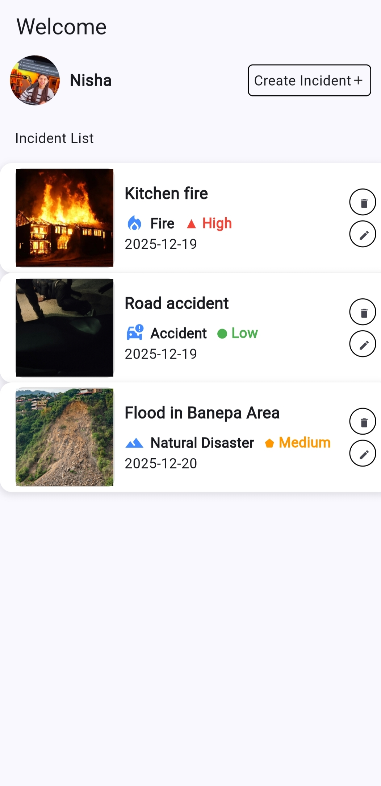
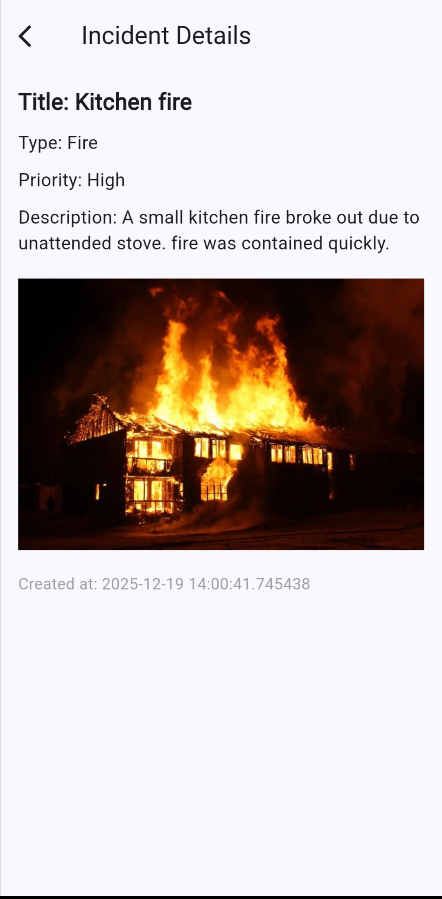
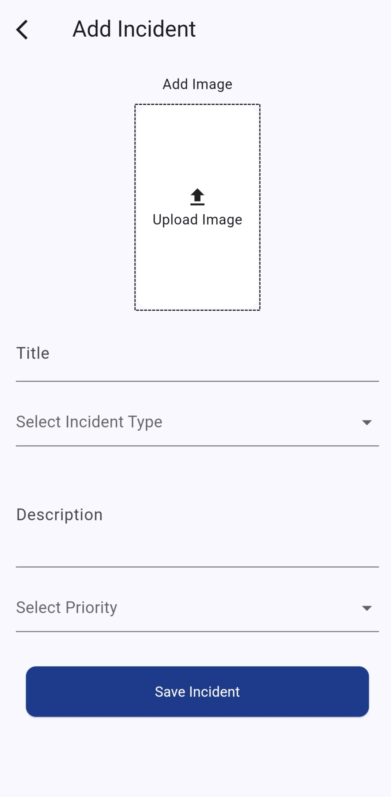
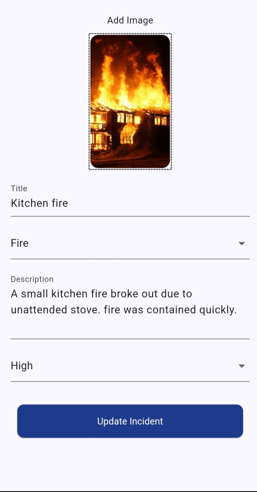
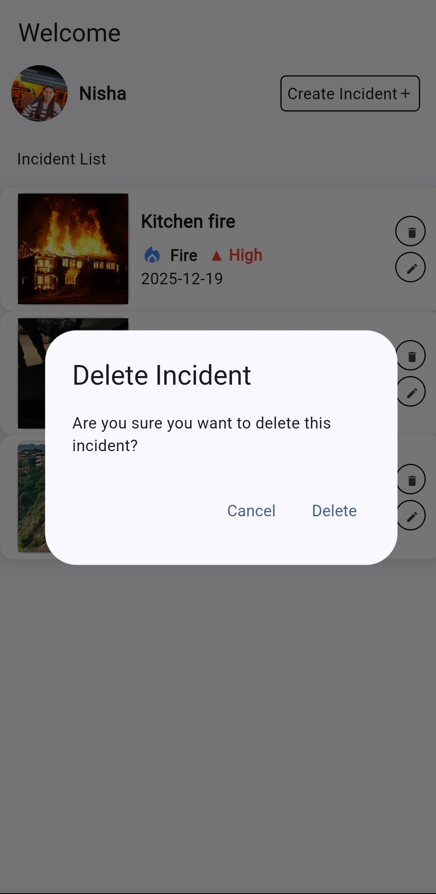

# Smart Incident Reporter

A Flutter mobile application to **create, manage, and track incident reports**. Users can register, upload incidents with priority, attach images, and view incident details. The app uses **Firebase** for authentication, Firestore for data storage, and **Firebase Storage** for images. **Riverpod** is used for state management, and **Beamer** is used for navigation.

---

## Features

- Email/password registration and login using Firebase Authentication  
- User profile management: update name and profile image  
- Create, view, update, and delete incidents  
- Incident details: title, type, priority, description, image, timestamp  
- Image upload to Firebase Storage  
- Incident types fetched from an API  
- Priority levels: Low, Medium, High  
- Visual differentiation of incident types and priority levels using icons and colors  

---

## Image Upload

- Users can select images from **camera or gallery**.  
- Images are uploaded to a **cloud storage service** (Cloudinary) securely.  
- The uploaded image URL is stored in **Firebase Firestore** along with the incident or user profile data.  
- This allows images to be accessible across devices and sessions without exposing sensitive credentials.

---

## Screenshots

Login Screen:  


Register Screen:  


Home Screen:  


Details Screen:  


Add Incident Screen:  


Update Incident Screen:  


Delete Incident Screen:  


Profile Screen:  


---

## Flutter Version

```text
Flutter 3.24.3 • Dart 3.5.5
